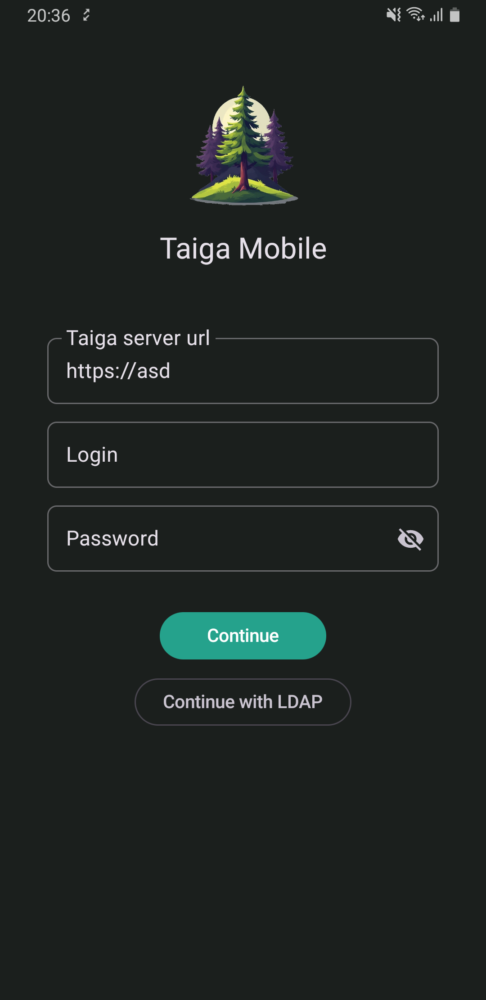
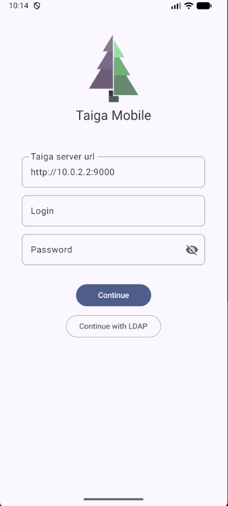
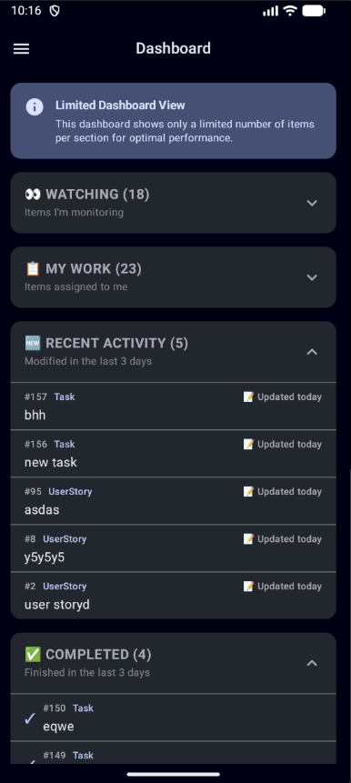
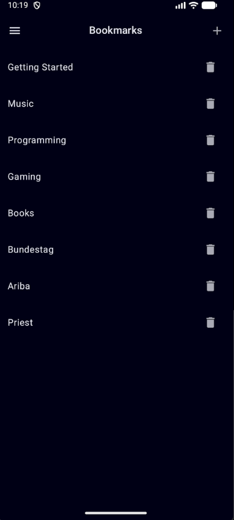
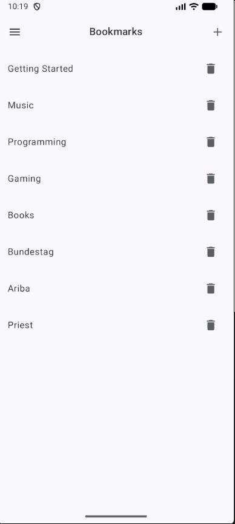
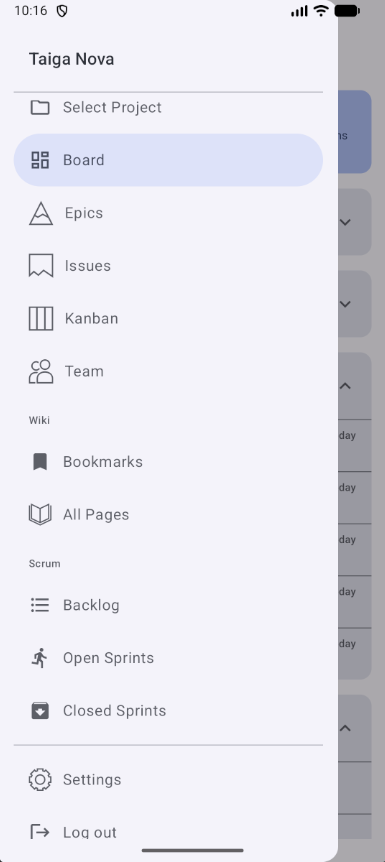
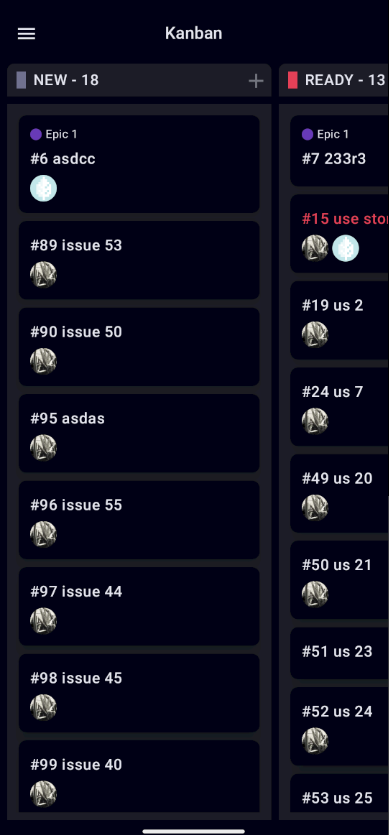
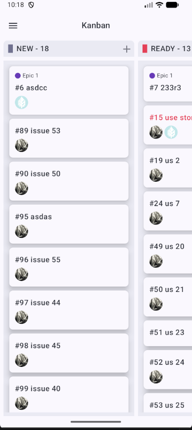

 

# Taiga Mobile Nova

This is the **unofficial** Android app for the agile project management system [taiga.io](https://www.taiga.io/).

The previous author archived the original project. This version has been almost completely rewritten with modern Android development practices.

**Coming soon:** Google Play (I actually need help with that, [here are the details](https://github.com/Grigoriym/TaigaMobileNova/issues/203)) and F-Droid (still waiting, here are my MRs [1](https://gitlab.com/fdroid/rfp/-/issues/3511) and [2](https://gitlab.com/fdroid/fdroiddata/-/merge_requests/32013))
**Future plans:** I plan to migrate this project to Kotlin Multiplatform (KMP), enabling iOS support

[Project board](https://tasks.gregstuff.click/project/taigamobilenova/kanban)

## Screenshots

| Dark Mode | Light Mode |
|-----------|------------|
|  |  |
|  |  |
|  |  |
|  |  |
|  |  |
|  |  |
|  | |

## Features

### View & Browse
* Projects
* Epics
* User stories
* Tasks
* Issues
* Sprints
* Profiles
* Wiki
* Dashboard

### Create, Edit & Delete
* Epics
* User stories
* Tasks
* Issues
* Sprints
* Wiki pages

### Additional Features
* Leave and delete comments
* Kanban board (for sprints and user stories)
* Filters for user stories, epics, and issues
* Permissions validation

## About
This project is a complete rewrite of the [original TaigaMobile app](https://github.com/EugeneTheDev/TaigaMobile) (now archived) using modern Android development practices and Jetpack Compose.
