[](https://app.codacy.com/gh/Grigoriym/TaigaMobileNova/dashboard?utm_source=gh&utm_medium=referral&utm_content=&utm_campaign=Badge_grade) [](https://codecov.io/gh/Grigoriym/TaigaMobileNova)

# Taiga Mobile Nova

This is the **unofficial** Kotlin Multiplatform client for the agile project management system [taiga.io](https://www.taiga.io/), targeting **Android**, **iOS**, and **Desktop** (Linux/macOS/Windows).

The previous author archived the original project. This version has been completely rewritten using Kotlin Multiplatform and Compose Multiplatform.

## Platforms

| Platform | Status | Distribution |
|----------|--------|--------------|
| Android  | Released | Google Play & F-Droid |
| iOS      | Builds & runs | Distribution TBD |
| Desktop (Linux / macOS / Windows) | Builds & runs | Distribution TBD |

### Android

[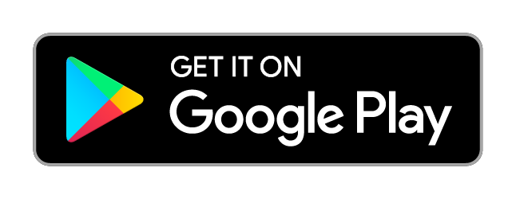](https://play.google.com/store/apps/details?id=com.grappim.taigamobile)
[](https://f-droid.org/en/packages/com.grappim.taigamobile.fdroid/)

### iOS & Desktop

iOS and Desktop builds are functional but distribution channels are not yet set up. If you want to try them, clone the repo and build locally — see [Build Commands](#build-commands) below.

[Project board](https://tasks.gregstuff.click/project/taigamobilenova/kanban)

## Screenshots

| Dark Mode | Light Mode |
|-----------|------------|
| 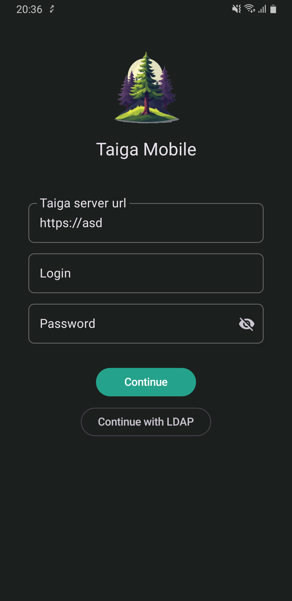 | 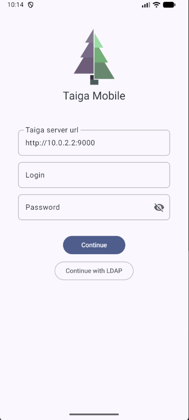 |
| 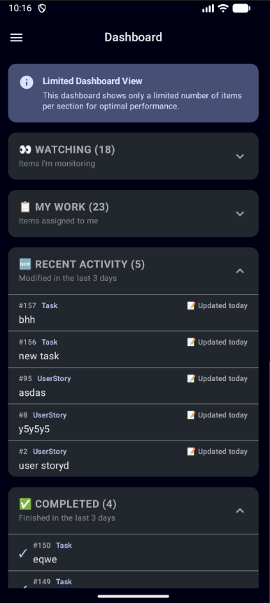 | 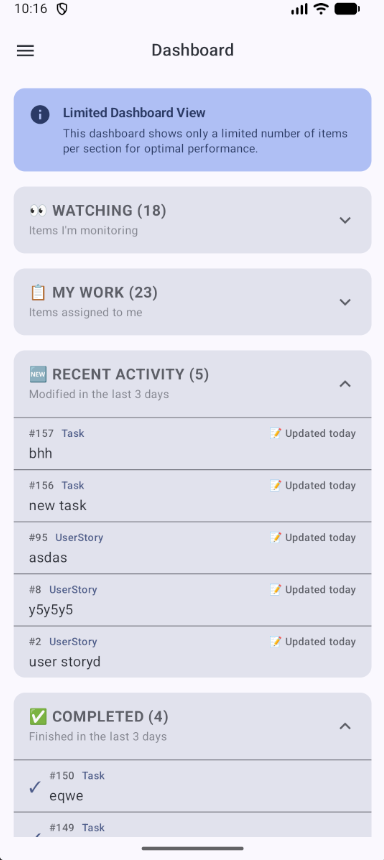 |
| 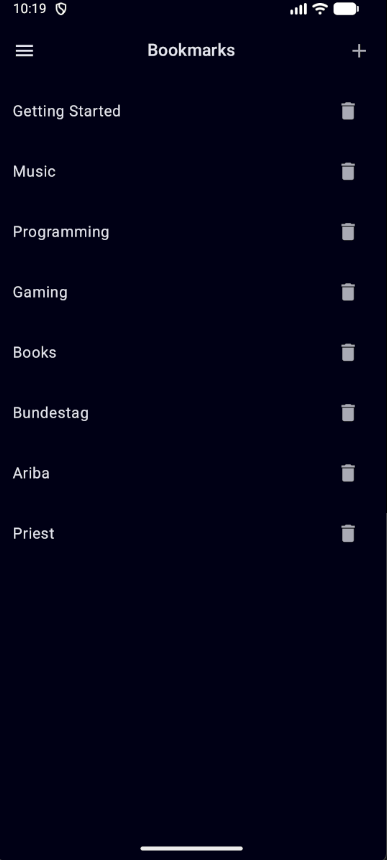 | 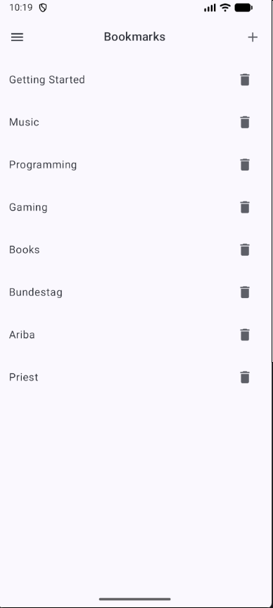 |
| 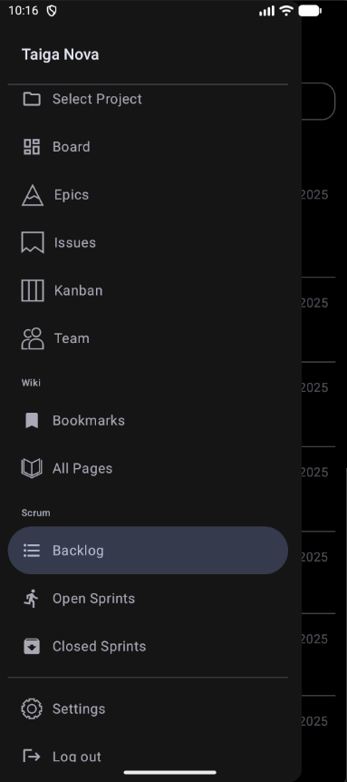 | 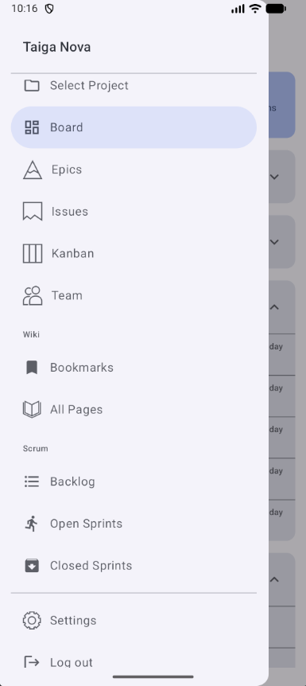 |
| 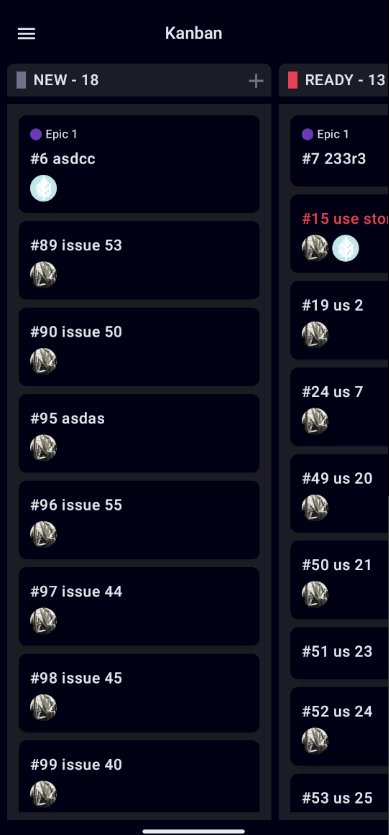 | 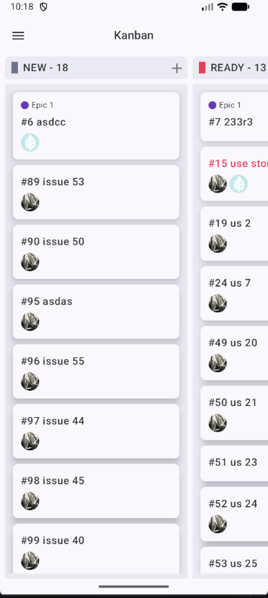 |
| 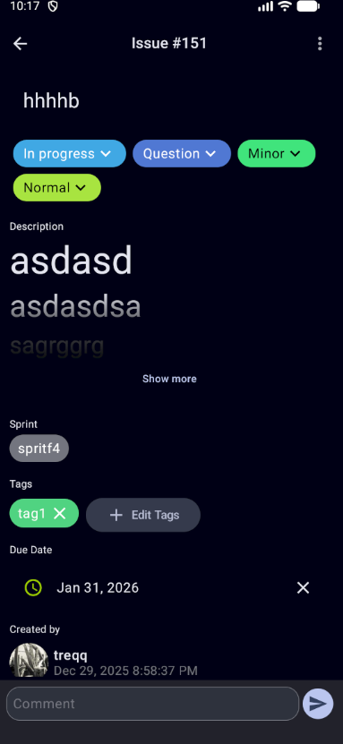 | 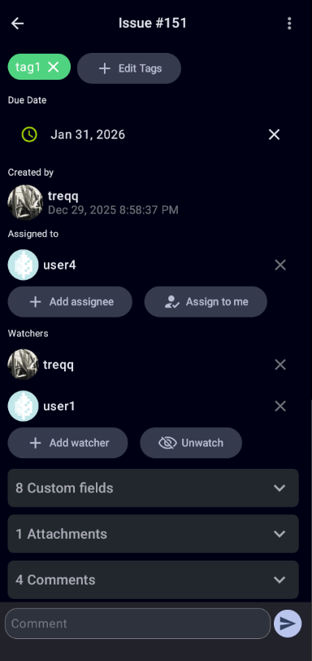 |
| 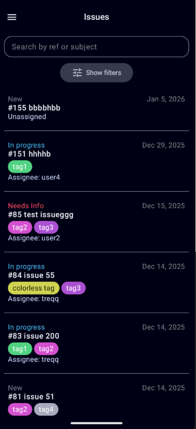 | |

## Features

### View & Browse
* Projects
* Epics
* User stories
* Tasks
* Issues
* Sprints
* Profiles
* Wiki
* Dashboard

### Create, Edit & Delete
* Epics
* User stories
* Tasks
* Issues
* Sprints
* Wiki pages

### Additional Features
* Leave and delete comments
* Kanban board (for sprints and user stories)
* Filters for user stories, epics, and issues
* Permissions validation

## Build Commands

```bash
# Android
./gradlew :androidApp:assembleGplayDebug
./gradlew :androidApp:assembleFdroidDebug

# Desktop — run or package
./gradlew :composeApp:run
./gradlew :composeApp:packageDistributionForCurrentOS   # .deb / .dmg / .msi

# iOS framework (called automatically by Xcode)
./gradlew :composeApp:linkReleaseFrameworkIosSimulatorArm64
./gradlew :composeApp:linkReleaseFrameworkIosArm64
```

## About
This project is a complete rewrite of the [original TaigaMobile app](https://github.com/EugeneTheDev/TaigaMobile) (now archived), rebuilt from scratch with Kotlin Multiplatform, Compose Multiplatform, and modern architecture.
